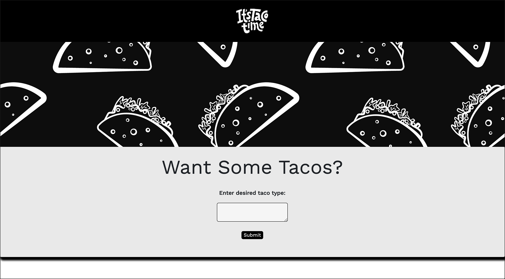
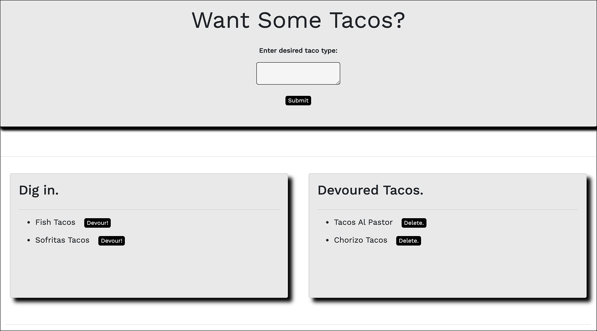

# Taco Time
‏‏‎
‎‎ 
 
 
 
  

  ---
  
  
&nbsp;

    

## Description 

&nbsp;

<strong><em>What is this project? Why did you make this project? How did you make this project?</strong></em>

&nbsp;

Taco Time is a full stack application example that follows the `Model-View-Controller` design pattern. The `MVC` approach is very commonly used when developing user interfaces. The idea being that each section of code has it's own purpose, and those purposes are different from each other. The `Model` is responsible for managing the data within the application and receives user input from the controller. The `View` is everything that makes up the user interface, it is responsible for the design/layout and how the user interacts with the application. it is the appearance of the website/application. The `Controller` acts as a liason between the model and the view, tying the two together. It receives the input and decides what should be done with it. The controller is the brains of the entire operation. This specific application is made possible through the use of `Node.js`, `Express.js`, `Handlebars.js`, `MySQL`, + a homemade `ORM`. This application is actively deployed via `Heroku`.

&nbsp;

View the application here =>‏‏‎ ‎‏‏‎ ‎‏‏‎ ‎‏‏[`Taco Time`](https://taco-time-handlebars.herokuapp.com/)

&nbsp;

---

&nbsp;

## Table of Contents: 

&nbsp;

* [Usage](#usage)
* [License](#license)
* [Credits](#credits)
* [Questions](#questions)

&nbsp;

---

&nbsp;

## Usage

&nbsp;

<strong><em>Instructions and examples for usage:</strong></em>

&nbsp;

This taco themed modular application allows for custom user input and upon submission will move the input to a "Dig in" section of the page below. `Handlebars.js`template engine is used to dynamically generate this HTML and a "Devour" button along with it. Each time a user provides input, it is placed in a list within this section. The "Devour" button can be clicked, and the input will then be moved to a separate "Devoured Tacos" section. At this time, a new "Delete" button will be applied upon generation, and the "Devoured" button is removed. `Express.js` is used within the `Controller` to handle this user input, interact with the model via `CRUD` operations, and return the query results to the `View`. The "Devoured Taco" list items can then be individually deleted, or can optionally continue to be stored. This is made possible through the custom `ORM` and a `MySQL` persistent database. Although this application is fairly minimal in appearance/functionality, there is a lot going on under the hood.

&nbsp;

---

&nbsp;

 

&nbsp;

---

&nbsp;

 

&nbsp;

---

&nbsp;

&nbsp;

---

&nbsp;

## License

&nbsp;

This project is covered under the MIT license. 

&nbsp;

---

&nbsp;

## Credits

&nbsp;

<strong><em>Third party assets:</strong></em>

&nbsp;

`Node.js` =>‏‏‎ ‎ ‏‏‎ ‎[An asynchronous event-driven runtime built on Chrome's V8 JavaScript engine.](https://nodejs.org/en/)

&nbsp;‏‏‎‏‏‎ ‎<strong>+</strong>

`Express.js` =>‏‏‎ ‎ ‏‏‎ ‎[A fast, unopinionated, minimalist web framework for Node.js](https://expressjs.com/)

&nbsp;‏‏‎‏‏‎ ‎<strong>+</strong>

`MySQL` =>‏‏‎ ‎ ‏‏‎ ‎[The world's most popular open source database ](https://www.mysql.com/)

&nbsp;‏‏‎‏‏‎ ‎<strong>+</strong>

`MySQL npm` =>‏‏‎ ‎ ‏‏‎ ‎[A pure Node.js JavaScript Client implementing the MySQL protocol.](https://www.npmjs.com/package/mysql)

&nbsp;‏‏‎‏‏‎ ‎<strong>+</strong>

`Handlebars.js` =>‏‏‎ ‎ ‏‏‎ ‎[Minimalistic semantic templating on steroids.](https://handlebarsjs.com/)

&nbsp;‏‏‎‏‏‎ ‎<strong>+</strong>

`Heroku` =>‏‏‎ ‎ ‏‏‎ ‎[A platform that enables developers to build, run, & operate applications entirely in the cloud.](https://www.heroku.com)

&nbsp;‏‏‎‏‏‎ ‎<strong>+</strong>

`dotenv npm` =>‏‏‎ ‎ ‏‏‎ ‎[Shhhhhh!](https://www.npmjs.com/package/dotenv)

&nbsp;

---

&nbsp;

## Questions?

&nbsp;

Shoot me an e-mail! => jonathan@jonathanschimpf.com

&nbsp;

Check out more of my work here on =>
[GitHub](http://github.com/jonathanschimpf)

&nbsp;

